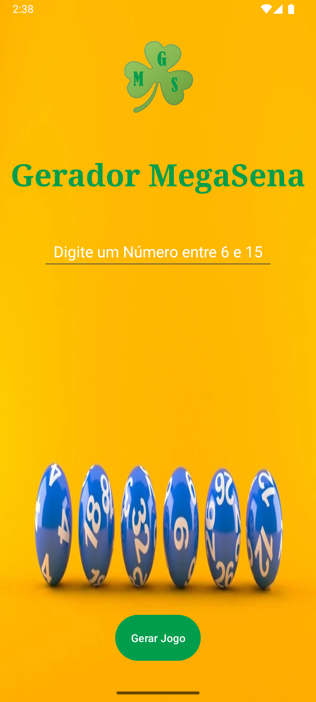

<h1 align="center"; style="font-weight: bold;">App Gerador MegaSena</h1>

<h3 align="center"></h3>

    
    
    

 

    <a href="#sobre">Sobre</a> • 
    <a href="#grupo">Integrantes do Grupo</a> •
    <a href="#interface">Interface</a> •
    <a href="#how-it-works">Funcionalidades</a> • 
    <a href="#licença">Licença</a>

<h2 id="sobre">📖 Sobre</h2>
App como Atividade da disciplina Desenvolvimento Mobile, ministrada pelo professor Odair Gabriel da Silva na Faculdade Impacta, durante o terceiro semestre do curso Análise e Desenvolvimento de Sistemas cursado no 2º Semestre de 2025.
  

 

<h2 id="grupo">👥 Integrantes do Grupo</h2>
<table align="center">
  <tr>
    <td align="center">
       
      <b>Erick Xavier Ribeiro</b>  
        
        
    </td>
    <td align="center">
       
      <b>Julia Lourenço Nogueira</b>  
        
      
    </td>
    <td align="center">
       
      <b>Lucas Aguiar Nunes</b>  
      
      
    </td>
    <td align="center">
       
      <b>Murillo Luiz Inácio de Souza</b>  
      
      
    </td>
    <td align="center">
       
      <b>Vinicius Ferreira de Freitas</b>  
      
      
    </td>
  </tr>
</table>

<h2 id="interface">🖥️ Interface</h2>

✦ Icone  

✦ Main  

✦ Main Rodando  

<h2 id="how-it-works">⚙️ Funcionalidades</h2>
🔹 Gerar Jogo de Mega Sena com quantidade números informado pelo usuário.

<h2 id="licença">📜 Licença</h2>
Este projeto é para fins educacionais e está disponível sob a <a href="./LICENSE">Licença MIT.</a>
